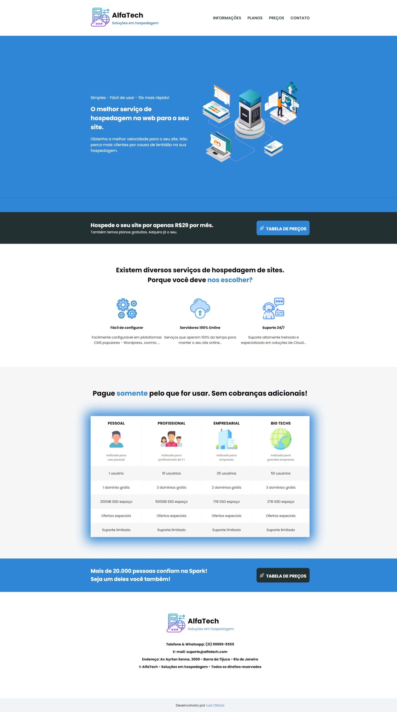
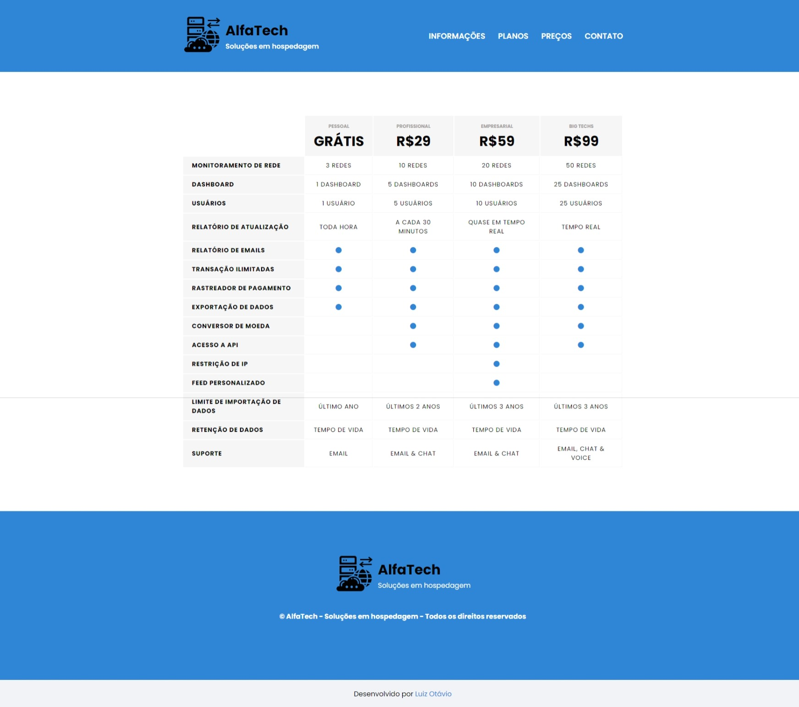

# Projeto:  Website para um provedor de hospedagem

## Projeto de um site com duas páginas, coloquei em prática os assuntos abordados nas aulas de HTML sobre tabelas, estilização CSS e posicionamento (Ainda falta a segunda página).

# Preview do projeto

> Status do Projeto: Em desenvolvimento :warning:
